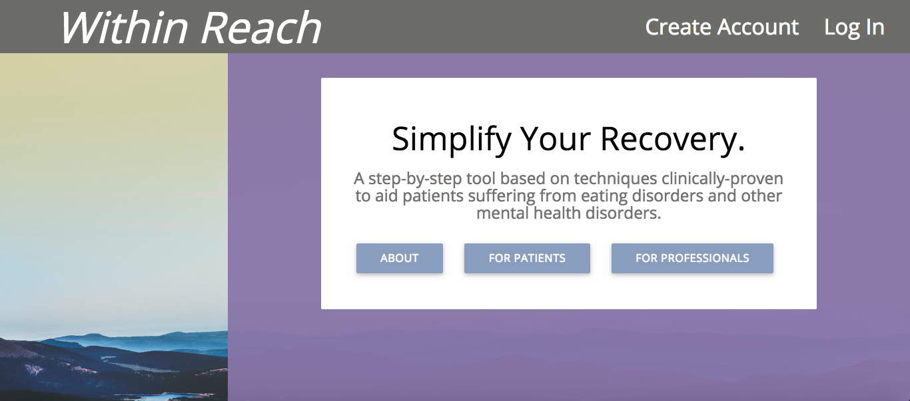
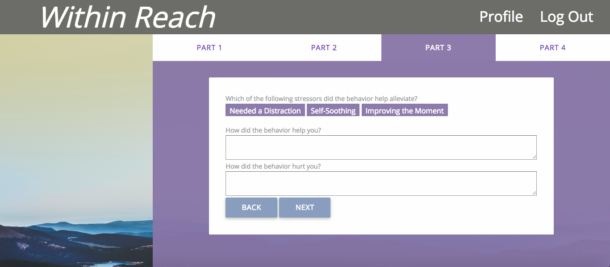
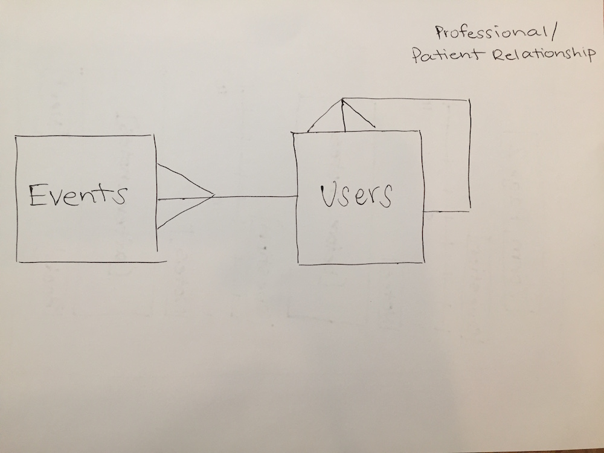
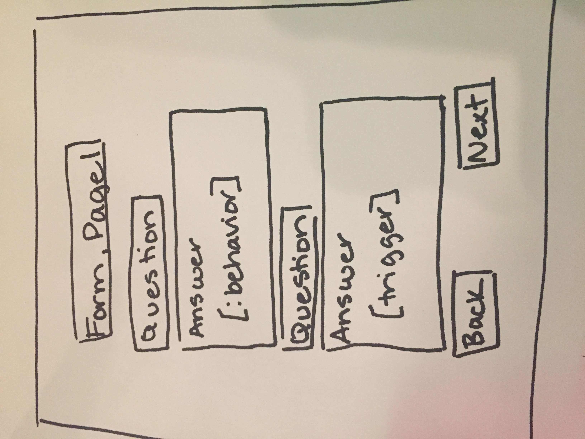
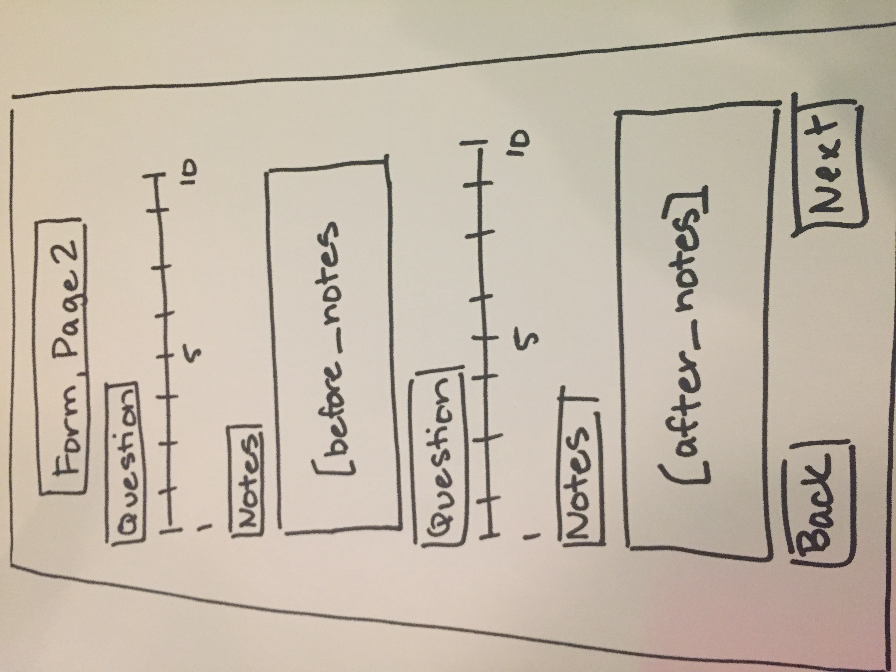
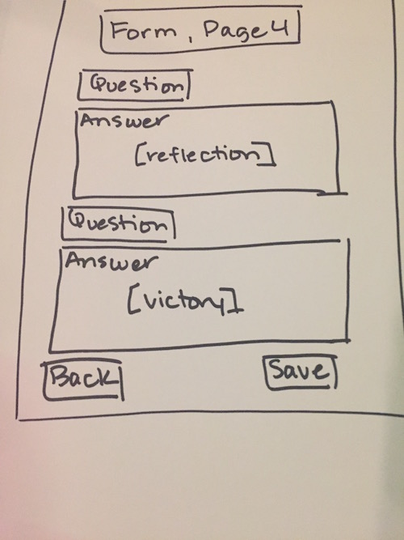

#Within Reach

<strong>[Check out Within Reach on Heroku](https://morning-lake-71506.herokuapp.com/)</strong>

##About
<strong>Easy - Accessible - Private</strong>
 
Within Reach is a mobile friendly app geared at men and women who rely on Dialectical Behavior Therapy as part of their recovery process.  While our app is specifically designed with eating disorders in mind, it can extend toward many other disorders, as well.

Prior to Within Reach, a workbook acted as the main source of journal entry, a vital aspect in reflecting during the recovery process.  Now, Within Reach offers users a way to easily and privately access a condensed version of these forms on their computers or phones.  With such ease in accessibility, we aim to encourage a more immediate entry- making the entries more detailed, fresh in mind, and therefore more helpful in reflection.

Users also have the option of sharing their entries with their professional, or can choose to keep their entries private.

##Team Members
* Misha LeClair: [Check out Misha's Github] (https://github.com/sfnewzgirl)
* Sam Darbonne: [Check out Sam's Github] (https://github.com/SamDarbonne)
* Nick Budig: [Check out Nick's Github] (https://github.com/14budig)
* Laura Russell: [Check out Laura's Github] (https://github.com/laurakathleen)

Welcome/Splash page:

Interactive forms:

Mobile-friendly forms:

##Built With
* Ruby on Rails
* Postgresql
* Javascript
* Jquery
* SASS - Styling
* Materialize - Styling
* Lazy High Charts Gem - Data Visualization
* Chartkick Gem - Data Visualization
* Kaminari Gem - Pagination
* Bcrypt - Encryption

##Planning
* [Trello](https://trello.com/b/wN9GwKrO/project-2)
* ERD: 

* Wireframes for forms:

<strong>Please note that this app is currently not HIPAA compliant</strong>
